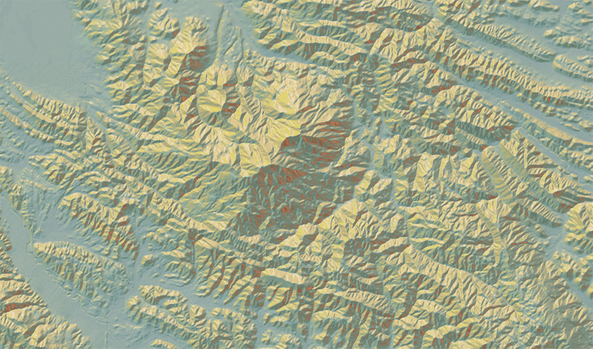

The Mapzen terrain tiles provide basemap elevation coverage of the world in a raster tile format.

Our raster tiles are square-shaped grids of geographic data that contain elevation data in a raw or processed format.

Tiles are available for zooms 0 through 15 and are available in several spatial data formats including processed PNG images, which are optimized for mobile and web display, and raw elevation GeoTIFFs for desktop analytical use. Data is available in both projected Web Mercator (EPSG:3857) and non-projected geographic coordinate system [WGS84](https://en.wikipedia.org/wiki/World_Geodetic_System) ([EPSG:4326](http://spatialreference.org/ref/epsg/wgs-84/)) formats.

If you are familiar with [digital elevation models](https://en.wikipedia.org/wiki/Digital_elevation_model) (DEMs) or [digital terrain models](http://tx.technion.ac.il/~dalyot/docs/Intro-DTM.pdf) (DTMs), this service is for you!

With terrain tiles you have the power to customize the content and visual appearance of the map and perform analysis on the desktop.
