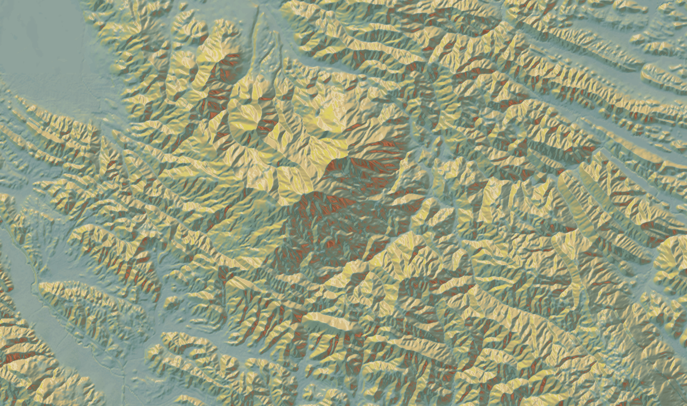

The [Mapzen terrain tiles](https://mapzen.com/projects/joerd) provide basemap terrain coverage of the world in a raster tile format.

Raster tiles are square-shaped grids of geographic data that contain contain either elevation data in a raw or processed format.

Tiles are available for zooms 0 through 15 and are available in several spatial data formats including PNG and GeoTIFF. The tiles also can be in a raw elevation and processed normal value format that's optimized for mobile and web display, and desktop analytical use. Data is available in both web Mercator projected and raw latlng.

With terrain tiles you have the power to customize the content and visual appearance of the map and perform analysis on the desktop.
